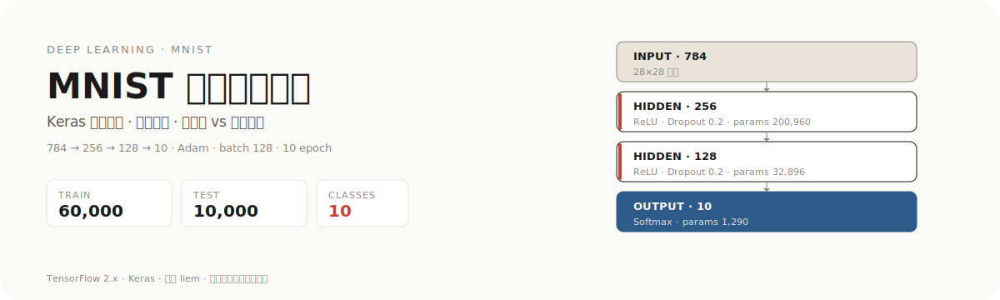

<p align="center">
  
</p>

# MNIST 手写数字分类

基于 Keras 高层 API 实现神经网络的手写数字分类任务，并对比交叉熵损失与均方误差损失对分类性能的影响。深度学习基础与应用课程实训项目。

## 模型结构

```
输入层 784 (28×28 展平)
   ↓
隐藏层 1 · 256 · ReLU · Dropout(0.2)
   ↓
隐藏层 2 · 128 · ReLU · Dropout(0.2)
   ↓
输出层 10 · Softmax
```

- **前向传播**：`z = W·x + b`，`a = activation(z)`，最终 Softmax 转概率分布
- **反向传播**：链式法则逐层反向传播梯度，`W = W - lr * gradient`
- **优化器**：Adam 自适应学习率，`batch_size=128`，验证集监控过拟合

## 任务说明

### 任务一：手写数字分类
- 加载 MNIST、预处理（归一化、展平、one-hot）
- Keras Sequential 构建网络，训练 10 epoch、评估、保存加载
- 训练历史与预测结果可视化

### 任务二：损失函数对比

| 特性 | 交叉熵损失 | 均方误差损失 |
|------|-----------|-------------|
| 公式 | -Σ(y·log(ŷ)) | (1/n)·Σ(y-ŷ)² |
| 适用 | 分类任务 | 回归任务 |
| 收敛速度 | 快 | 慢 |
| 最终准确率 | 高 | 较低 |
| 梯度特性 | 与误差成正比 | 受 Softmax 导数影响 |

## 项目结构

```
├── task1_mnist_keras.py       # 任务一：手写数字分类
├── task2_loss_comparison.py   # 任务二：损失函数对比
├── test_models.py             # 测试脚本
├── run_all.py                 # 主运行脚本（菜单）
├── mnist_model.keras          # 训练好的模型（运行后生成）
├── task1_training_history.png # 训练历史图（运行后生成）
├── task1_predictions.png      # 预测结果图（运行后生成）
└── task2_loss_comparison.png  # 损失对比图（运行后生成）
```

## 运行方式

```bash
# 安装依赖
pip install tensorflow numpy matplotlib

# 方式一：主脚本（推荐，菜单选择）
python run_all.py

# 方式二：单独运行
python task1_mnist_keras.py      # 任务一
python task2_loss_comparison.py  # 任务二
python test_models.py            # 测试
```

## 输出文件

- `mnist_model.keras`：训练好的分类模型
- `task1_training_history.png`：训练损失与准确率曲线
- `task1_predictions.png`：预测结果可视化
- `task2_loss_comparison.png`：损失函数对比图

## 注意事项

1. 首次运行自动下载 MNIST 数据集（约 11MB）
2. 训练需几分钟，请耐心等待
3. 确保足够磁盘空间保存模型和图像
4. 中文显示问题请检查系统字体配置

---

<p align="center"><sub>作者 liem · 深度学习基础与应用 · 广东工商职业技术大学</sub></p>
