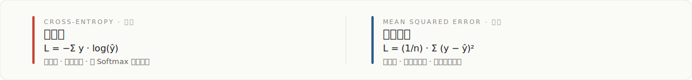

# MNIST 手写数字分类


> 基于 Keras/TensorFlow 的神经网络后向传播实现，在同一架构下对比交叉熵与均方误差两种损失函数在手写数字分类任务上的训练动态与最终准确率。

---

## 模型结构与产物证明

四层全连接神经网络，结构如下：

| 层级 | 神经元 | 激活 | 备注 |
| --- | --- | --- | --- |
| Input | 784 | — | 28×28 展平 |
| Hidden 1 | 256 | ReLU | Dropout 0.2 |
| Hidden 2 | 128 | ReLU | Dropout 0.2 |
| Output | 10 | Softmax | 概率输出 |

任务一与任务二运行后会在仓库根目录生成以下文件作为可验证证明：

- `mnist_model.keras` — 训练完成的 Keras 模型权重
- `task1_training_history.png` — 训练/验证准确率与损失曲线
- `task1_predictions.png` — 测试集预测结果可视化
- `task2_loss_comparison.png` — 交叉熵 vs 均方误差 收敛对比图

---

## 这是什么

用 Keras 高层 API 搭建一个四层全连接神经网络，在 MNIST 数据集上完成 0–9 手写数字分类，并在同一网络、同一优化器、同一数据下，仅替换损失函数，对比交叉熵与均方误差的表现。

## 为什么不同

不是调用 `model.fit()` 的"黑箱"作业。本项目把反向传播的链式法则拆开摆出来：每一层的梯度如何由后向前逐层传递，权重如何按 `W ← W − lr · ∇W` 更新，以及为什么分类任务应使用交叉熵而非均方误差。任务二通过仅替换损失函数、保持其他变量不变，使两种损失的对比变量唯一。

## 工作原理

### 前向传播

`z = W · x + b`，经激活函数 `a = σ(z)` 逐层传递；输出层 Softmax 把 logits 转为 10 类概率分布 `ŷ`。

### 反向传播

基于链式法则，从损失函数对输出层的梯度开始，逐层反向计算 `∂L/∂W` 与 `∂L/∂b`，再以学习率 `lr` 更新参数：

```
W ← W − lr · ∇W
b ← b − lr · ∇b
```

Keras 在 `model.fit()` 内部完成的正是这一过程。

### 优化器与训练配置

- 优化器：Adam（自适应矩估计）
- 批大小：128
- 训练轮数：10 epoch
- 验证集：从训练集中切分监控

### 损失函数对比



| 特性 | 交叉熵 Cross-Entropy | 均方误差 MSE |
| --- | --- | --- |
| 公式 | `−Σ y · log(ŷ)` | `(1/n) · Σ (y − ŷ)²` |
| 适用任务 | 分类 | 回归 |
| 收敛速度 | 快 | 慢 |
| 准确率 | 高 | 较低 |
| 与 Softmax 配合 | 梯度表达式简洁 | 梯度含 `ŷ(1−ŷ)` 项，饱和区梯度小 |

## 如何使用

### 1. 安装依赖

```bash
pip install tensorflow numpy matplotlib
```

### 2. 一键运行

```bash
python run_all.py
```

该脚本依次执行：任务一（加载 MNIST → 训练 → 评估 → 保存模型 → 可视化）→ 任务二（损失函数对比）→ 单元测试。

### 3. 单独运行

```bash
python task1_mnist_keras.py      # 仅任务一：手写数字分类
python task2_loss_comparison.py  # 仅任务二：损失函数对比
python test_models.py            # 模型结构与 IO 单元测试
```

## 输出文件

| 文件 | 说明 |
| --- | --- |
| `mnist_model.keras` | 训练完成的 Keras 模型，可由 `tf.keras.models.load_model` 加载 |
| `task1_training_history.png` | 训练/验证准确率与损失随 epoch 变化曲线 |
| `task1_predictions.png` | 测试集前若干样本的预测结果可视化 |
| `task2_loss_comparison.png` | 交叉熵与 MSE 的损失曲线与准确率对比 |

## 注意事项

- 首次运行会自动下载 MNIST 数据集（约 11 MB），存放于用户目录 `~/.keras/datasets/`。
- 训练 10 epoch 在 CPU 上约需数分钟，GPU 则更快。
- 可视化图中的中文标签需系统装有中文字体；若显示为方块，请在 matplotlib 配置中指定 `SimHei` 或 `Microsoft YaHei` 等字体。

## 项目结构

```
mnist-classification/
├── task1_mnist_keras.py        # 任务一：手写数字分类
├── task2_loss_comparison.py    # 任务二：损失函数对比
├── test_models.py              # 单元测试
├── run_all.py                  # 一键运行入口
├── mnist_model.keras           # 训练产物：模型
├── task1_training_history.png  # 训练产物：曲线图
├── task1_predictions.png       # 训练产物：预测可视化
└── task2_loss_comparison.png   # 训练产物：损失对比图
```

---

作者：**liem** · 深度学习基础与应用 · 广东工商职业技术大学
